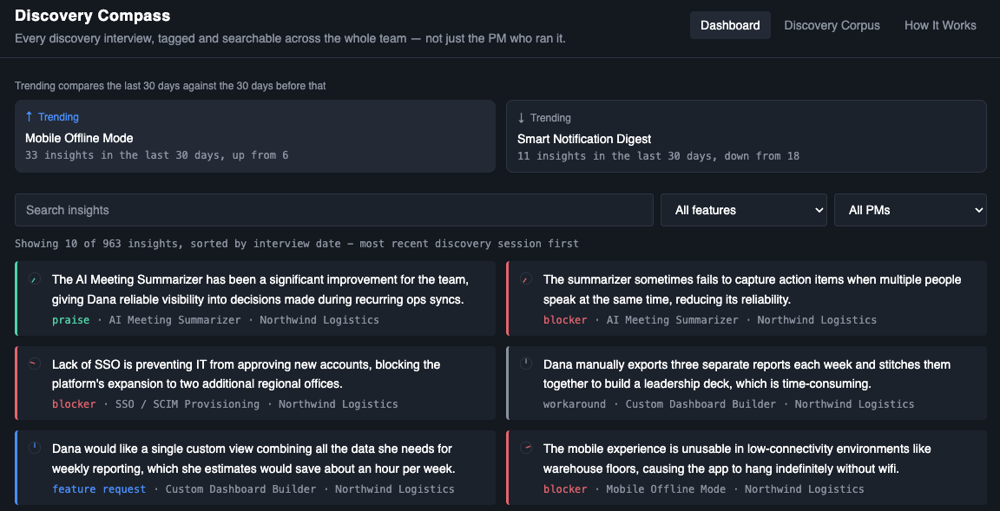

# Discovery Compass

An AI-powered discovery interview intelligence tool for product teams. Each PM interviews customers about the feature they own — but customers naturally bring up everything else too. Discovery Compass reads every transcript, decomposes it into individual insights, tags each one to the specific feature it's about, and surfaces it on a shared dashboard the whole team can search and filter — so signal from any conversation reaches the PM who actually owns it, not just whoever conducted the interview.

**Live:** [discovery-compass-live.vercel.app](https://discovery-compass-live.vercel.app)




## The problem

Discovery interviews are a goldmine of customer signal, but in most teams that signal is siloed by whoever happened to run the interview. A PM interviewing about Feature A often hears real, useful feedback about Features B, C, and D — and that feedback typically evaporates unless they remember to manually pass it along. Across hundreds of interviews over time, that's a lot of lost signal.

## How it works

1. A transcript is processed by Claude, which breaks it into discrete insight snippets — individual moments where the customer raised a blocker, feature request, piece of praise, confusion, or workaround.
2. Each snippet is tagged against a shared feature taxonomy and stored alongside which PM owns that feature.
3. Every PM can browse and filter the full, shared pool of insights — not just their own interviews — with a "my features" view that surfaces what's relevant to them first.
4. A trending strip highlights the single feature gaining the most mentions and the one cooling off, comparing the last 30 days against the 30 days before, based on when each interview actually happened.

## Screens

- **Dashboard** — the main view. A trending strip, search and filter controls (by feature, by PM), and a feed of tagged insights. Clicking an insight opens a summary of the interview it came from, with a link to the full transcript.
- **Discovery Corpus** — the searchable archive of every interview, with an AI-generated summary and the full transcript available on expand.
- **How It Works** — a guided replay of a real interview being decomposed into insights live, showing the tagging and cross-PM routing mechanic in action.

## Why the public site is read-only

The deployed site only reads from the database — it never writes. New interviews are ingested by running scripts locally against the database using a separate secret key that never ships to the browser. This keeps the live site free to run at any traffic volume (no risk of a stranger triggering paid API calls or writing garbage data into a public database) while still demonstrating the full mechanic through the How It Works replay.

## Demo dataset

The dataset is fictional: 5 PMs, 20 features across 5 themes (Retention, Growth, Tech Debt, AI/Automation, Enterprise/Compliance), and 100 synthetic discovery interviews generated by Claude and spread across a 6-month window, with two features deliberately trending up and down to demonstrate the trending logic against real data shape.

## Tech stack

React · Vite · Tailwind CSS v4 · Supabase (Postgres) · Claude API (Anthropic) · Vercel

## Local development

```bash
npm install
npm run dev
```

Requires a `.env` file with:
VITE_SUPABASE_URL=
VITE_SUPABASE_PUBLISHABLE_KEY=


## Data ingestion scripts

Located in `/scripts`, run separately from the deployed app using a Supabase secret key (never exposed to the browser):

- `ingest.js` — process a single transcript file into tagged, stored insights
- `generate.js` — generate a full synthetic dataset of interviews for demo purposes
- `backfill-summaries.js` — generate AI summaries for interviews that don't yet have one
